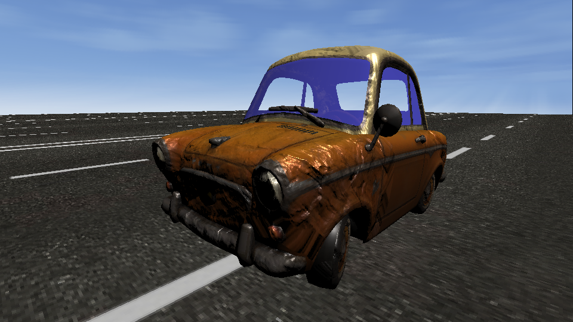
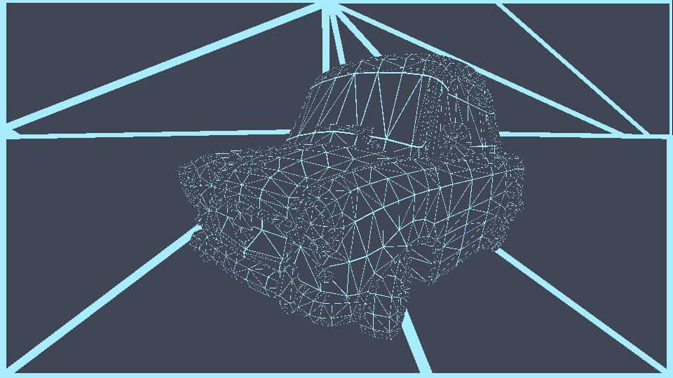
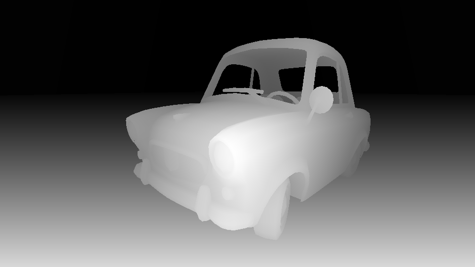
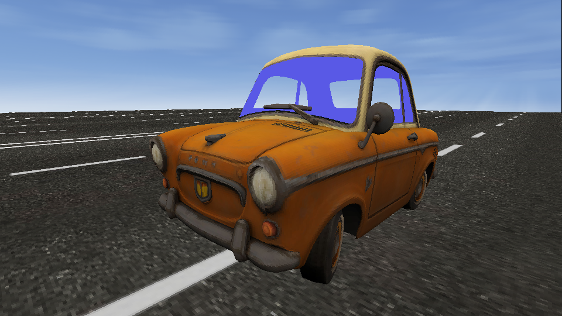
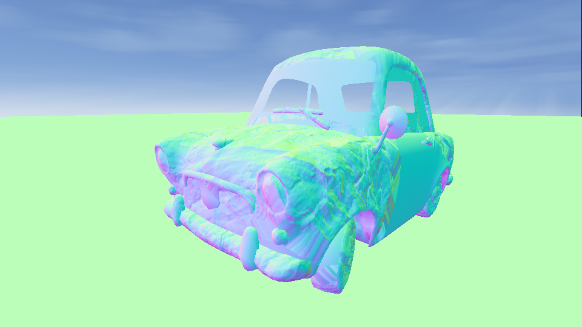
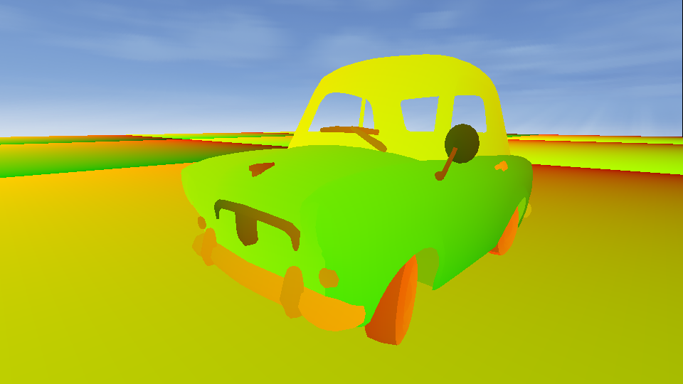
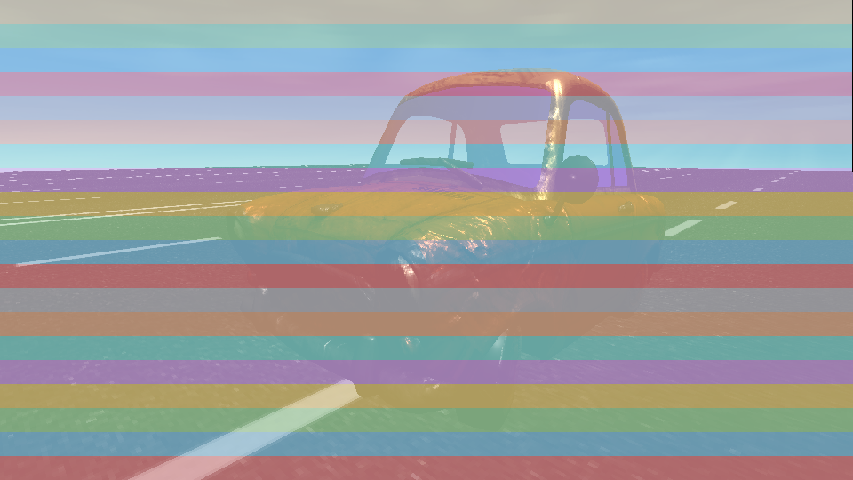

# MyRender · 纯 CPU 软渲染器，复刻 Unity URP

> 一个用 C++ 写的软件渲染器：**不调用任何显卡 API**，每一个像素都由 CPU 一行代码一行代码算出来。
> 目标是把 Unity 通用渲染管线（URP）里常见的渲染效果，在 CPU 上从头复刻一遍——而且**每一步都能断点、能打印、能截图看见**。

<p align="center">
  
</p>

作者：**项思炼**　·　仓库：https://github.com/xslkim/MyRender　·　如果它帮到了你，欢迎点个 ⭐ Star

---

## 这是什么

学 Unity 的 Shader 时最难受的一点：它跑在 **GPU** 上，你没法设断点、没法打印一个中间变量，出了问题只能靠猜。

MyRender 把整条 GPU 流水线搬到 **CPU** 上用 C++ 重写了一遍。慢一点完全没关系，换来的是——

- ✅ **每个中间变量都看得见**：内置一组调试可视化（线框 / 深度 / 法线 / albedo / UV / 多线程分条），随手截图。
- ✅ **写法贴着 Unity HLSL**：`gpu/` 层的函数名、全局变量名（`UNITY_MATRIX_M/V/P`、`_MainLightPosition`、`_BaseMap`…）和 URP 一一对应，Unity 里学的东西能直接搬过来读。
- ✅ **场景就是一段 JSON**：相机、光源、物体的参数和 Unity 面板一一对应，左手坐标系，可以拿 Unity 当“标准答案”逐项对照。

> 渲染一帧只做五件事：清缓冲 → 上传相机/光源 → 逐物体算模型矩阵并 Draw → 逐三角形做顶点着色/裁剪/光栅化/深度/混合 → 颜色缓冲转 sRGB 交给屏幕。

## 📺 配套视频系列

本仓库同时是一套教学视频《CPU软渲染 复刻Unity URP》的工程，分三集：**EP1 总览 · EP2 管线 · EP3 光照**。

视频脚本（分镜 + 旁白）就放在仓库里，有三种不同讲法的备选版本，可以直接当**图文教程**阅读：

| 版本 | 风格 | 适合谁 |
|------|------|--------|
| [output1](docs/video/output1/) | 调试驱动 · 务实 | C++ 工程师，想跟着源码和真实截图走 |
| [output2](docs/video/output2/) | 直觉故事 · 零门槛 | 没有图形学基础，想先听懂“是什么” |
| [output3](docs/video/output3/) | 对照 Unity · 图解 | 学过一点 URP，想搞清 Shader 里到底发生了什么 |

## 看得见的管线

下面每一张都是这个渲染器**实跑输出**的画面（用内置截图模式一次导出）：

| 线框 | 深度 | 底色 (albedo) |
|:---:|:---:|:---:|
|  |  |  |
| **贴图法线** | **UV** | **多线程分条** |
|  |  |  |

## 快速开始

环境：Windows + MSVC + CMake，C++20。SDL3 已随仓库提供（静态链接）。

```powershell
# 构建
cmake -B build -S .
cmake --build build --config Release

# 运行（开窗实时渲染，相机环绕小车）
.\build\Release\MyRender.exe

# 无窗口截图模式：把线框/深度/法线/albedo/UV/多线程等调试图一次性导出到 out\
.\build\Release\MyRender.exe --capture out
```

两个可执行文件：`MyRender`（渲染器）和 `test`（单元测试）。

## 项目结构

```
MyRender/
├── src/                            渲染器源码
│   ├── MyRender.cpp                 程序入口：初始化 SDL3 → 加载场景 → 游戏循环
│   │
│   ├── base/                        数学与顶点 I/O
│   │   ├── Vector.hpp / Matrix.hpp      模板向量/矩阵（float2/3/4、half3/4…）
│   │   ├── Attributes.hpp / Varyings.hpp 顶点着色器的输入/输出结构
│   │   └── mikktspace.*                  切线空间（法线贴图用）
│   │
│   ├── core/                        场景层 + 渲染管线
│   │   ├── Scene / Camera / Light / Gameobject   从 JSON 读场景
│   │   ├── Render.hpp   ⭐ 管线核心：裁剪 → 光栅化 → 透视校正插值 → 片元 → 深度 → 混合
│   │   ├── Material / LitMat / SimpleLitMat / UnLitMat  材质（持有 vs/fs 指针）
│   │   ├── Mesh / Texture / Image                资源
│   │   └── *Cache.hpp                Texture/Material/Mesh 缓存（避免重复加载）
│   │
│   └── gpu/                         着色层 —— 故意写得像 Unity HLSL
│       ├── ShaderGlobal.hpp   全局着色状态（UNITY_MATRIX_*、_BaseMap…）+ 调试视图开关
│       ├── ShaderFunction.hpp HLSL 内置函数（mul / normalize / lerp / 坐标变换…）
│       ├── LitShader / SimpleLitShader / UnLitShader     顶点/片元着色器实现
│       └── BRDF / Lighting / ImageBasedLighting / GlobalIllumination  PBR 光照
│
├── assets/car/         示例场景：小车（OBJ 网格 + TGA 贴图 + 场景/材质 JSON）
├── include/nlohmann/   JSON 库（第三方）
├── SDL/                SDL3（开窗与显示，静态库）
├── test/ + test.cpp    单元测试（矩阵、投影、视图变换…）
│
└── docs/
    ├── video/output1·2·3/   📺 视频脚本（三种讲法）+ 截图素材
    └── authoring/           教学文档、分镜、Unity 对照图
```

## 代码导读：从 Unity 搬过来读

| 你在 Unity 里知道的 | 在这里对应 |
|---|---|
| Inspector 面板配置场景 | [assets/car/car_scene.json](assets/car/car_scene.json) + [src/core/Scene.hpp](src/core/Scene.hpp) |
| `.shader` / HLSL 顶点·片元着色器 | [src/gpu/LitShader.hpp](src/gpu/LitShader.hpp) 等 |
| `UnityCG`/`Core.hlsl` 内置函数 | [src/gpu/ShaderFunction.hpp](src/gpu/ShaderFunction.hpp) |
| `UNITY_MATRIX_*`、`_MainLight*` 全局量 | [src/gpu/ShaderGlobal.hpp](src/gpu/ShaderGlobal.hpp) |
| GPU 固定管线（裁剪/光栅化/深度/混合） | [src/core/Render.hpp](src/core/Render.hpp) |
| URP 的 Lit / SimpleLit / Unlit | [src/core/LitMat.hpp](src/core/LitMat.hpp) / [SimpleLitMat](src/core/SimpleLitMat.hpp) / [UnLitMat](src/core/UnLitMat.hpp) |

想看“每一步长什么样”：在调用 `Draw` 前设置 `gpu::g_debugView`（`DV_WIRE` / `DV_DEPTH` / `DV_NORMAL_GEOM` / `DV_NORMAL_MAPPED` / `DV_ALBEDO` / `DV_UV` / `DV_THREADS`），或直接跑 `--capture` 一次导出全部。

## 致谢与许可

- 作者：**项思炼**
- 第三方：[SDL3](https://www.libsdl.org/)、[nlohmann/json](https://github.com/nlohmann/json)、[MikkTSpace](http://www.mikktspace.com/)
- License：见 [LICENSE](LICENSE)

如果这个项目对你理解渲染管线有帮助，欢迎到 https://github.com/xslkim/MyRender 点一个 ⭐。
